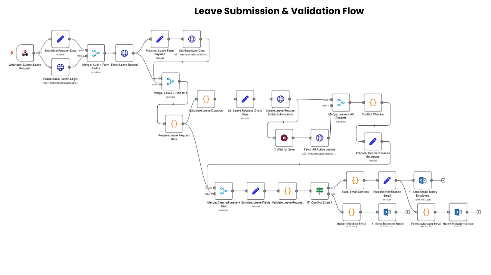
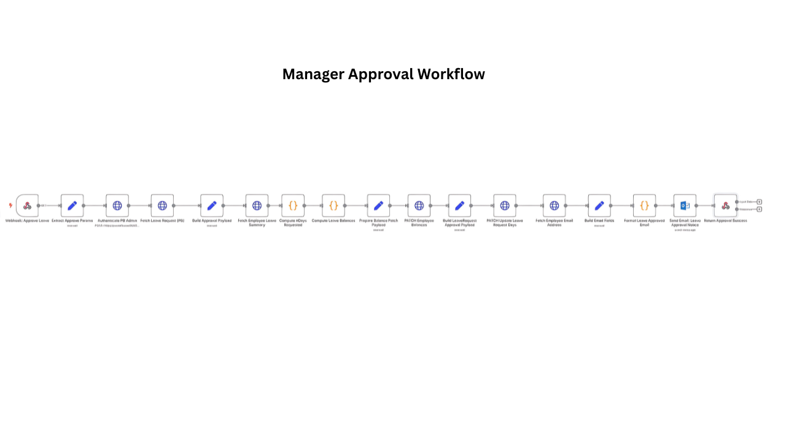
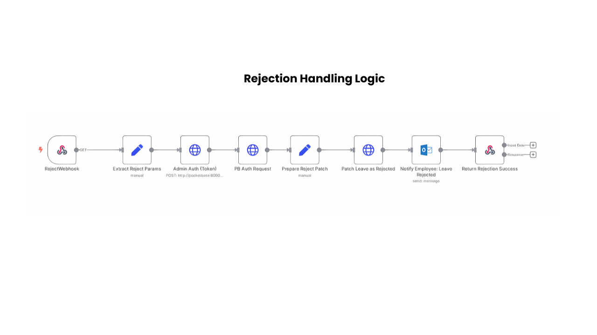
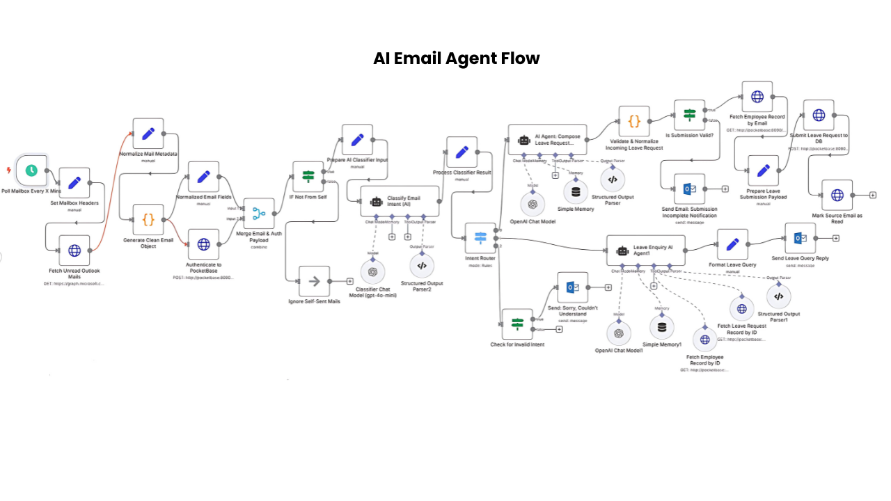

# Leave & Vacation Automation Platform – Powered by n8n, PocketBase & Docker

[](#)
[](#)
[](#)

---

## 📚 Table of Contents

- [Overview](#overview)
- [Features](#features)
- [Live Workflow](#live-workflow)
- [Installation](#installation)
- [Environment Setup](#environment-setup)
- [Docker Usage](#docker-usage)
- [Folder Structure](#folder-structure)
- [Security & Backups](#security--backups)
- [Example Screens](#example-screens)
- [Contributing](#contributing)
- [License](#license)
- [Maintainer](#maintainer)

---

## Overview

This platform offers AI-assisted leave management automation designed for startups and enterprise teams alike — hosted via Docker and powered by:

 n8n for workflows, smart approval logic, and email handling

- PocketBase for secure data storage with real-time triggers

- Runs on AWS EC2, Docker-managed, ready for scale


What it does:

- Employees query leave balances via AI

- Conflict checks auto-run (no duplicates or ghost teams)

- Managers approve via email buttons — no logins

- All events logged, backed up, and auditable

This repo combines operational automation with real-world devops structure — making it deployable in 10 minutes with zero manual DB edits.

---

## Features

✔️ Ask AI, Not HR
Employees query their leave balance using a natural language interface powered by n8n.

✔️ Auto Conflict Checks
The system cross-validates leave requests to avoid team scheduling conflicts.

✔️ One-Click Email Approval
Managers receive emails with pre-built "Approve/Reject" buttons — no logins, no drama.

✔️ Database Magic via PocketBase
All leave data is stored and synced in PocketBase — schema-less, realtime, zero-ops.

✔️ End-to-End Logging
Every action is auditable, timestamped, and backed up daily.

✔️ Cloud or Local Ready
Runs on AWS, local machines, or internal networks with full Docker support.

✔️ Backups Without Sweat
Daily .tar.gz backups of all volumes, auto-cleaned after 7 days.

✔️ Enterprise-Friendly
Support for basic auth, webhook privacy, and security-hardened env settings.

---

## Live Workflow

1️⃣ Employee Says: "How many days of annual leave do I have left?"
→ Our n8n-powered AI agent responds in seconds.

2️⃣ Leave Form Submitted
→ Employee selects leave type, duration, and reason — stored instantly in PocketBase.

3️⃣ Automation Triggers
→ System checks for policy compliance + overlaps with team calendars.

4️⃣ Email to Manager
→ Clean "Approve" or "Reject" email lands in manager’s inbox. One tap. Done.

5️⃣ Realtime Sync
→ PocketBase updates the leave record, status, and audit logs.

6️⃣ Daily Backups
→ All leave data is backed up automatically to .tar.gz in your backups folder.

---

## Installation

1️⃣ Clone the Repo

```bash
git clone https://github.com/NiiOsa1/n8n-automation.git
cd n8n-automation
```

2️⃣ Set Up Secrets and URLs
Edit .env with your credentials:

```bash
N8N_HOST=n8n.yourdomain.com
N8N_BASIC_AUTH_USER=admin
N8N_BASIC_AUTH_PASSWORD=your-password
PB_ADMIN_EMAIL=your@email.com
PB_ADMIN_PASSWORD=supersecure
```

3️⃣ Lock Down Your Secrets

```bash
chmod 600 .env
```

4️⃣ Ensure Docker & Docker Compose Are Installed

```bash
docker --version
docker compose version
```

---

## Environment Setup

Before running the platform, configure your environment variables to match your production or demo context. This is done through `.env` files.

### 📁 `.env` (Production)

Create a file named `.env` in the project root with the following keys:

# --- n8n ---
N8N_BASIC_AUTH_ACTIVE=true
N8N_BASIC_AUTH_USER=admin
N8N_BASIC_AUTH_PASSWORD=supersecurepassword
N8N_HOST=n8n.example.com
N8N_PORT=5678

# --- PocketBase ---
PB_ADMIN_EMAIL=michael@example.com
PB_ADMIN_PASSWORD=secretpass
PB_PORT=8090

# --- Common ---
WEBHOOK_BASE_URL=https://n8n.example.com
EDITOR_BASE_URL=https://n8n.example.com
🔐 Security Tip: Run chmod 600 .env to restrict permissions.

🧪 .env.demo (Optional for MVP Testing)
You can also create a separate .env.demo for testing/demo setups.

env
Copy
Edit
N8N_BASIC_AUTH_ACTIVE=false
N8N_HOST=localhost
N8N_PORT=5678

PB_ADMIN_EMAIL=test@example.com
PB_ADMIN_PASSWORD=test123
PB_PORT=8090
This demo file can be used in combination with:

```bash
docker-compose --env-file .env.demo -f docker-compose.demo.yml up
```

---

## Docker Usage

✅ Start Services (Production Mode)
 
	```bash
docker compose --env-file .env up -d --build
```

🔁 Stop & Restart Cleanly

```bash
docker compose down
docker compose --env-file .env up -d --force-recreate
```

🔍 Health Status

```bash
docker ps
docker inspect <container_id>
```

🛠️ Rebuild Only n8n

```bash
docker compose build n8n
docker compose restart n8n
```

🧪 Spin Up Demo/Test Instance

```bash
docker compose --env-file .env.demo -f docker-compose.demo.yml up -d --build
```

This uses:

- .env.demo (safe creds)

- docker-compose.demo.yml (custom ports/volumes)

- Reuses real backups

---

##  Folder Structure 

```bash
n8n-automation/
├── .env                     #  Production secrets and runtime configs
├── backups/                 #  Compressed `.tar.gz` backups (auto-generated)
├── backup_all.sh            #  Cron-based daily backup script
├── restore.sh               #  Interactive restore script
├── docker-compose.yml       #  Main Docker compose file
├── docker-n8n/              # 🛠️Custom Dockerfile for n8n
├── docker-pb/               # 🛠️Custom Dockerfile for PocketBase
├── pb-webhook-bridge/       #  Realtime PocketBase → n8n webhook listener
│   └── index.cjs            # → Auth + EventSource-based bridge logic
├── n8n_data/                #  Persistent volume for n8n
├── pocketbase-data/         #  Persistent volume for PocketBase
├── pocketbase-logs/         #  PocketBase logs (optional)
├── pb_migrations/           #  Migration scripts (if needed)
├── settings_import.json     #  Exported n8n settings (optional)
└── banner-leave-automation.png # itHub banner (Leave & Vacation themed)
```

---

## Security & Backups 

This automation stack is designed for resilience and confidentiality, offering both passive protection and proactive recovery:

✅ .env Lockdown

- Secrets like credentials and encryption keys are stored in .env

- Enforced permissions with chmod 600 .env restrict access

✅ Basic Authentication

- n8n is protected via HTTP Basic Auth:

```bash
N8N_BASIC_AUTH_ACTIVE=true
N8N_BASIC_AUTH_USER=admin
N8N_BASIC_AUTH_PASSWORD=supersecurepassword
```

✅ Webhook Safety

- Production webhooks bypass public authentication safely:

```bash
N8N_DISABLE_PRODUCTION_MAIN_WEBHOOK_AUTHENTICATION=true
```

🔁 Automated Daily Backups

- Cron job runs backup_all.sh every day at 2:00 AM:

```bash
0 2 * * * /home/ubuntu/n8n-automation/backup_all.sh
```

- Backups saved in /backups/ and auto-cleaned after 7 days

♻️ One-Step Restore

```restore.sh``` handles recovery:

- Lists backups

- Restores volumes

- Restarts services


Health Monitoring

- Docker healthcheck auto-detects failure and self-heals both n8n and PocketBase containers

---

## Example Screens





